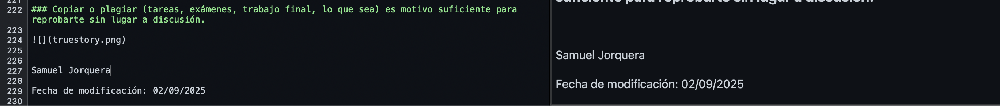
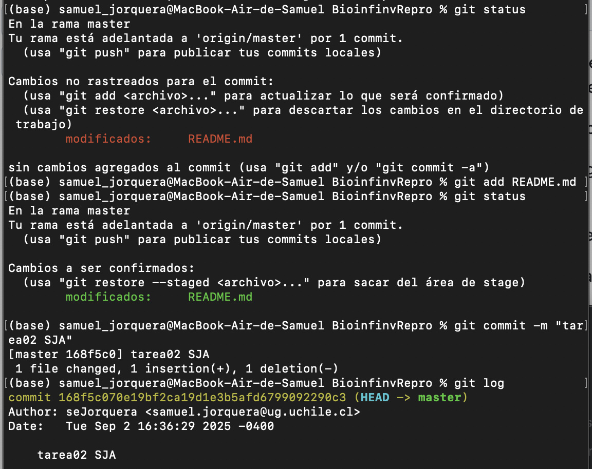

# Tarea 02
**Author:** Samuel Jorquera

Contains the documents and figures for the homework of the second session of the course.

This homework consisted of the replication of the [*stacks* manual](https://catchenlab.life.illinois.edu/stacks/manual/#procrad) (HTML) in md language. .md archive can be found in **meta** with the file name "SJorquera_Tarea02.md"

Additionally, certain task were about repositories modifications. First, the "BioinfinvRepro.git"  was cloned, then the README.md file was modified by the following:

Then, this modifications were added and commited to the user branch of the repository (however, not pushed further):

Finally, a final task consisted of answersing certain questions about the [*stacks*](https://catchenlab.life.illinois.edu/stacks/manual/#procrad) script. The answers can be found in **meta** with the name "stacks_pipeline_answers.md"

## Directories
**meta**: Contains the .md and figures for the homework resolution.