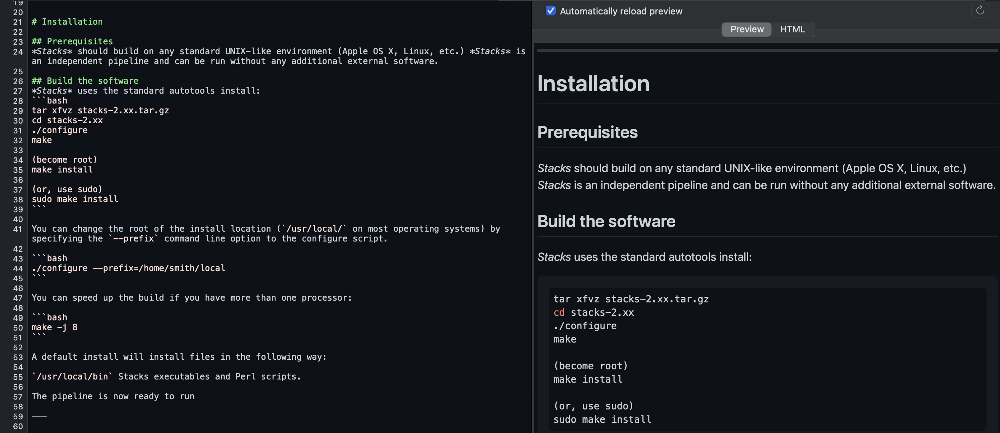

# Tarea 02
**Author:** Samuel Jorquera

Contains the documents and figures for the homework of the second session of the course.

This homework consisted of the replication of the [*stacks* manual](https://catchenlab.life.illinois.edu/stacks/manual/#procrad) (HTML) in md language.

**meta**: Contains the .md and figures for the homework resolution.