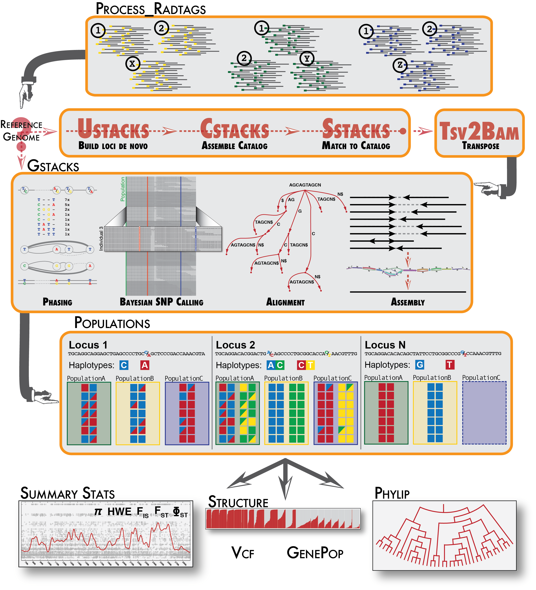

# Introduction
----- 
Several molecular approaches have been developed to focus short reads to specific, restriction-enzyme anchored positions in the genome. Reduced representation techniques such as CRoPS, RAD-seq, GBS, double-digest RAD-seq, and 2bRAD effectively subsample the genome of multiple individuals at homologous locations, allowing for single nucleotide polymorphisms (SNPs) to be identified and typed for tens or hundreds of thousands of markers spread evenly throughout the genome in large numbers of individuals. This family of reduced representation genotyping approaches has generically been called genotype-by-sequencing (GBS) or Restriction-site Associated DNA sequencing (RAD-seq). For a review of these technologies, see [Davey et al. 2011](https://doi.org/10.1038/nrg3012) or [Andrews, et al., 2016.](https://doi.org/10.1038/nrg.2015.28)

*Stacks* is designed to work with any restriction-enzyme based data, such as GBS, CRoPS, and both single and double digest RAD. *Stacks* is designed as a modular pipeline to efficiently curate and assemble large numbers of short-read sequences from multiple samples. *Stacks* identifies loci in a set of individuals, either *de novo* or aligned to a reference genome (including gapped alignments), and then genotypes each locus. *Stacks* incorporates a maximum likelihood statistical model to identify sequence polymorphisms and distinguish them from sequencing errors. *Stacks* employs a Catalog to record all loci identified in a population and matches individuals to that Catalog to determine which haplotype alleles are present at every locus in each individual.

*Stacks* is implemented in C++ with wrapper programs written in Perl. The core algorithms are multithreaded via OpenMP libraries and the software can handle data from hundreds of individuals, comprising millions of genotypes.

A *de novo* analysis in *Stacks* proceeds in six major stages. First, reads are demultiplexed and cleaned by the **process_radtags** program. The next three stages comprise the main *Stacks* pipeline: building loci (**uStacks**), creating the catalog of loci (**cStacks**), and matching against the catalog (**sStacks**). In the fifth stage, the **gStacks** program is executed to assemble and merge paired-end contigs, call variant sites in the population and genotypes in each sample. In the final stage, the **populations** program is executed, which can filter data, calculate population genetics statistics, and export a variety of data formats.

A reference-based analysis in *Stacks* proceeds in three major stages. The **process_radtags** program is executed as in a *de novo* analysis, then the **gStacks** program is executed, which will read in aligned reads to assemble loci (and genotype them as in a *de novo* analysis), followed by the **populations** program.

The image below diagrams the options.




-----


# Installation

## Prerequisites
*Stacks* should build on any standard UNIX-like environment (Apple OS X, Linux, etc.) *Stacks* is an independent pipeline and can be run without any additional external software.

## Build the software
*Stacks* uses the standard autotools install:
```bash
tar xfvz stacks-2.xx.tar.gz
cd stacks-2.xx
./configure
make

(become root)
make install

(or, use sudo)
sudo make install
```

You can change the root of the install location (`/usr/local/` on most operating systems) by specifying the `--prefix` command line option to the configure script.

```bash
./configure --prefix=/home/smith/local
```

You can speed up the build if you have more than one processor:

```bash
make -j 8
```

A default install will install files in the following way:

`/usr/local/bin` Stacks executables and Perl scripts.

The pipeline is now ready to run

---
 

# What types of data does *Stacks v2* support?
---

*Stacks* is designed to process data that *stacks* together. Primarily this consists of restriction enzyme-digested DNA. There are a few similar types of data that will stack-up and could be processed by *Stacks*, such as DNA flanked by primers as is produced in metagenomic 16S rRNA studies.

The goal in *Stacks* is to assemble loci in large numbers of individuals in a population or genetic cross, call SNPs within those loci, and then read haplotypes from them. Therefore *Stacks* wants data that is a uniform length, with coverage high enough to confidently call SNPs. Although it is very useful in other bioinformatic analyses to variably trim raw reads, this creates loci that have variable coverage, particularly at the 3’ end of the locus. In a population analysis, this results in SNPs that are called in some individuals but not in others, depending on the amount of trimming that went into the reads assembled into each locus, and this interferes with SNP and haplotype calling in large populations.

## Protocol type
*Stacks* supports all the major restriction-enzyme digest protocols such as RAD-seq, double-digest RAD-seq, and a subset of GBS protocols, among others.

## Sequencer Type
*Stacks* is optimized for short-read, Illumina-style sequencing. There is no limit to the length the sequences can be, although there is a hard-coded limit of 1024bp in the source code now for efficency reasons, but this limit could be raised if the technology warranted it.

*Stacks* can also be used with data produced by the Ion Torrent platform, but that platform produces reads of multiple lengths so to use this data with *Stacks* the reads have to be truncated to a particular length, discarding those reads below the chosen length. The **process_radtags** program can truncate the reads from an Ion Torrent run.

Other sequencing technologies could be used in theory, but often the cost versus the number of reads obtained is prohibitive for building stacks and calling SNPs.

## Paired-end Reads
*Stacks* directly supports paired-end reads, for both single and double digest protocols. In the case of a single-digest protocol, *Stacks* will use the staggered paired-end reads to assemble a contig across all of the individuals in the population. For double-digest RAD, both the single-end and paired-end reads are anchored by a contig and *Stacks* will assemble them into two loci. In both cases, the paired-end contig/locus will be merged with the single-end locus. If the loci do not overlap, they will be merged with a small buffer of Ns in between them.

---