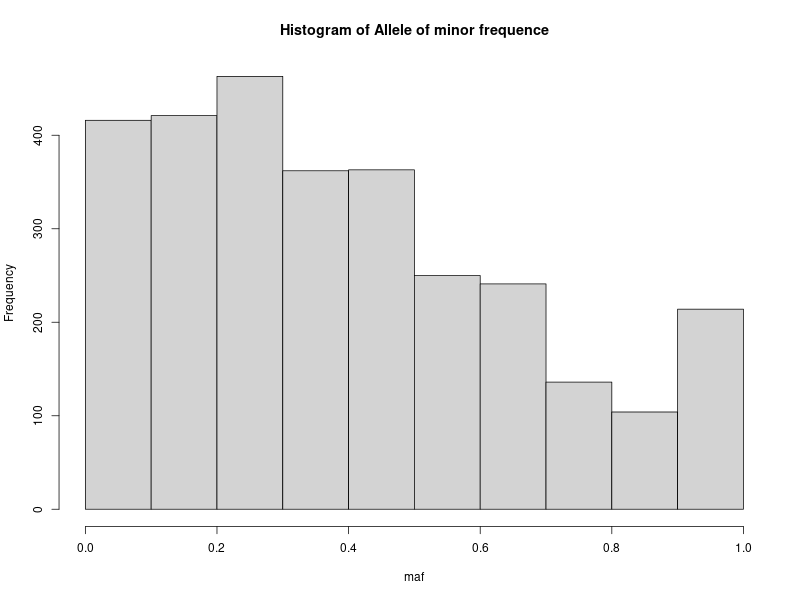

## Respuestas a Tarea04

**Autor:** Samuel Jorquera

### vcftools

El script se encuentra en el archivo ```Tarea4.sh```en la carpeta [**bin**](bin/)

1. ¿Cuántos individuos y variantes (SNPs) tiene el archivo?

Esto puede ser realizado sencillamente con vcftools, sin embargo, en este caso se aplicó el siguiente código:
```bash
num=$(grep -m1 "^#CHROM" /datos/compartido/ChileGenomico/GATK_ChGdb_recalibrated.autosomes.12262013.snps.known.vcf | wc -w)
indiv=$((num-9))
variantes=$(grep -v "^#" /datos/compartido/ChileGenomico/GATK_ChGdb_recalibrated.autosomes.12262013.snps.known.vcf | wc -l)
echo "Cantidad de individuos: $indiv - Numero de variantes $variantes"
```
Lo que nos entrega ```Cantidad de individuos: 18 - Numero de variantes 4450360```

2. ¿Cuántos sitios del archivo no tienen datos perdidos?

Se emplea el comando de vcftools: ```vcftools --vcf /datos/compartido/ChileGenomico/GATK_ChGdb_recalibrated.autosomes.12262013.snps.known.vcf --max-missing 1```

Lo que nos entrega el siguiente output
``` 
After filtering, kept 18 out of 18 Individuals
After filtering, kept 382626 out of a possible 4450360 Sites
```
Por lo que quedan 382626 sitios sin información perdida

3. Genera un archivo en tu carpeta de trabajo Prac_Uni5/data que contenga solo SNPs en una ventana de 2Mb en cualquier cromosoma. Nombra el ```archivoCLG_Chr<X>_<Start>-<End>Mb.vcf``` donde es número del cromosoma, es el inicio de la ventana genómica y es el final en megabases.

Se escoje el cromosoma 15, desde las bases 50 a 52 Mb:
```bash
#3: Archivo
vcftools --vcf /datos/compartido/ChileGenomico/GATK_ChGdb_recalibrated.autosomes.12262013.snps.known.vcf --chr 15 --from-bp 50000000 --to-bp 52000000 --recode -c > ../data/CLG_Chr15_50-52Mb.vcf
```

Lo que naturalmente no entrega ningún output, pero sí genera el archivo deseado.

4. Reporta cuántas variantes tiene el archivo generado.
Se emplea sencillamente 
```bash

#4 variantes en archivo generado
variantes2=$(grep -v "^#" ../data/CLG_Chr15_50-52Mb.vcf | wc -l)
echo "En el nuevo archivo hay $variantes2 variantes"
```

Lo que entrega el output: ```En el nuevo archivo hay 2972 variantes```

5. Reporta la cobertura promedio para todos los individuos del set de datos
Esto se puede hacer mediante la flag ```--depth``` en vcftools, lo que entrega un archivo out.idepth, que puede ser imprimido en pantalla como:

```bash
#5: Covertura
vcftools --vcf ../data/CLG_Chr15_50-52Mb.vcf --depth
echo "covertura por individuo:"
while read -r ind; do
        echo "$ind"
done < out.idepth
```

Y entrega el siguiente output:
```
covertura por individuo:
INDV		N_SITES	MEAN_DEPTH
ARI-008		2565	2.6885
ARI-014		2594	2.95027
ARI-1		2666	3.15679
ARI-15		2637	3.10391
ARI-9		2775	3.92865
ARI_018		2752	3.54397
Ari_006		2305	2.08069
Ari_021		2286	2.14611
Ari_023		2406	2.33292
CD5J-106	2375	2.44126
CD5J-108	1928	1.88485
CD5J-471	1585	1.58107
CDSJ_167	2481	2.3813
CDSJ_297	2766	3.54121
Cdsj_283	2250	2.06533
L19_CDSJ_321	2416	2.30008
L20_CDSJ_344	2510	2.51155
L21_CDSJ_472	2332	2.23027
```

6. Calcula la frecuencia de cada alelo para todos los individuos dentro del archivo y guarda el resultado en un archivo

Esto también se hace con vcftool mediante ```vcftools --vcf ../data/CLG_Chr15_50-52Mb.vcf --freq --out ../data/CLG_Chr15_50-52Mb_freqs.frq```

7. Filtra el archivo de frecuencias para solo incluir variantes bialélicas (tip: awk puede ser útil para realizar esta tarea, tip2: puedes usar bcftools para filtrar variantes con más de dos alelos antes de calcular las frecuencias)

Esta tarea es particularmente sencilla usando awk:

```awk '$3 == 2' ../data/CLG_Chr15_50-52Mb_freqs.frq > ../data/CLG_Chr15_50-52Mb_freqs_biallele.frq```

Podemos observar la diferencia en la cantidad de lineas por archivo:

```bash
$ wc -l ../data/CLG_Chr15_50-52Mb_freqs.frq
2973 ../data/CLG_Chr15_50-52Mb_freqs.frq
$ wc -l ../data/CLG_Chr15_50-52Mb_freqs_biallele.frq
2970 ../data/CLG_Chr15_50-52Mb_freqs_biallele.frq
```

Donde se observa que se eliminaron 2 variantes bialélicas.

*obs:* la cantidad de variantes es 2970, pues awk elimina también la fila de header.

8. Llama a un script escrito en lenguaje R que lee el archivo de frecuencias de variantes bialélicas y guarda un histograma con el espectro de MAF para las variantes bialélicas

Mediante R se responderán las preguntas 8 y 9. El script utilizado se encuentra en [bin/maf_frq.R](bin/). 

Así, se obtiene el histograma:




9. ¿Cuántos sitios tienen una frecuencia del alelo menor <0.05?

Tal como se indicó, el Script de R calculó esto mediante la siguiente linea:


```
#Sites with maf<0.05
maf05 <- nrow(maf_freq[maf_freq[,6] <0.05,])
paste0("La cantidad de sitios con maf<0.05 son: ", maf05)
```

Lo que entrega el output ```[1] "La cantidad de sitios con maf<0.05 son: 116"```

10. Calcula la heterocigosidad de cada individuo.

Al igual que en la pregunta 5, esto se responde con vcftools:

```bash
vcftools --vcf ../data/CLG_Chr15_50-52Mb.vcf --het
echo "heterocigocidad por individuo:"
while read -r ind; do
        echo "$ind"
done < out.het

```

11. Calcula la diversidad nucleotídica por sitio.
Una vez más, vcf tools. Esta vez como son varios sitios, no se imprimirá en pantalla, sino que se guardara en el archivo ```nucleotide_diversity.sites.pi```, disponible en la carpeta [results](results/):

```bash
vcftools --vcf ../data/CLG_Chr15_50-52Mb.vcf --site-pi --out nucleotide_diversity
```

12. Filtra los sitios que tengan una frecuencia del alelo menor <0.05

Nuevamente, esto puede realizarse usando la flag de vcftools: ```--maf```. Se guardará en un archivo llamado ```CLG_Chr15_50-52Mb_maf.recode.vcf``` en [results](results/):

```
vcftools --vcf ../data/CLG_Chr15_50-52Mb.vcf --maf 0.05 --recode --out ../data/CLG_Chr15_50-52Mb_maf
```

13. Convierte el archivo ```wolves_maf05.vcf``` a formato plink.

No encuentro dicho archivo, sin embargo, la conversión a formato plink puede hacerse mediante la flag ```--plink```en vcftools. Para ejemplo, se aplicará sobre el archivo recién creado:

```bash
vcftools --vcf ../data/CLG_Chr15_50-52Mb_maf.recode.vcf --plink --out ../data/CLG_Chr15_50-52Mb_maf.recode
```

Creando así los archivos ```CLG_Chr15_50-52Mb_maf.recode.map``` y ```CLG_Chr15_50-52Mb_maf.recode.ped```


### Plink
En este caso no consiste en un script, por lo que sencillamente se señalizarán los códigos empleados y los resultados obtenidos.

En primer lugar, se deben copiar los archivos de nombre ```chilean_all48_hg19``` y el archivo ```chilean_all48_hg19_popinfo.csv```. Esto se hace mediante ```cp```.

Dentro de la carpeta de ```/datos/compartido/ChileGenomico```, se aplican los siguientes comandos:

```bash
$ cp chilean_all48_hg19.bed ~/sjorquera/Tareas/Unidad2/Prac_Uni5/data/
$ cp chilean_all48_hg19.bim ~/sjorquera/Tareas/Unidad2/Prac_Uni5/data/
$ cp chilean_all48_hg19.fam ~/sjorquera/Tareas/Unidad2/Prac_Uni5/data/
$ cp chilean_all48_hg19_popinfo.cs ~/sjorquera/Tareas/Unidad2/Prac_Uni5/data/
```
finalmente, se setea el WD como ``` cd ~/sjorquera/Tareas/Unidad2/Prac_Uni5/code/```

1. Enlista los archivos plink que hay en ```data```. ¿Qué tipos de archivos son cada uno?

En particular, los archivos de tipo plink binario vienen de forma .bed, .bim y .fam. Por lo tanto, para identificar archivos con estas características, en primer lugar se deber buscar así:
```bash
ls -lh ../data/*.bed
```

Lo que devuelve lo siguiente:
```bash
-rw-r----- 1 bioinfo1 students 9,4M oct  2 23:33 ../data/chilean_all48_hg19.bed
```

Por lo que como solo existe el de nombre ```chilean_all48_hg19```, éste debería estar en los 3 formatos. En efecto:

```bash
ls -lh ../data/chilean_all48_hg19.*
```

Lo que entrega el siguiente resultado:
```bash
-rw-r----- 1 bioinfo1 students 9,4M oct  2 23:33 ../data/chilean_all48_hg19.bed
-rw-r----- 1 bioinfo1 students  23M oct  2 23:33 ../data/chilean_all48_hg19.bim
-rw-r----- 1 bioinfo1 students 1,1K oct  2 23:33 ../data/chilean_all48_hg19.fam
```

Los archivos ```.bed```son equivalentes a los .ped, pero en formato binario, y contiene la información genotípica por individuo, así como características generales de sexo, id familiar, o fenotipos (en caso de estudio de enfermedades).

Los archivos ```.bim``` corresponden a un mapeo de los alelos, indicando IDs, alelo mayor, o menor.

Finalmente, los archivos ```.fam``` finalmente indican la información de los pacientes de manera ordenada, entregando sexo, id familiar, o fenotipo.

2. Esta sección se realiza dentro del mismo tutorial.

3. (no existe)

4. Utiliza la info el archivo data/chilean_all48_hg19_popinfo.csv y el comando update-ids de plink para cambiar los nombres de las muestras de data/chilean_all48_hg19.fam de tal forma que el family ID corresponda a la info de la columna Categ.Altitud en maizteocintle_SNP50k_meta_extended.txt. Pista: este ejercicio requiere varias operaciones, puedes dividirlas en diferentes scripts de bash o de R y bash. Tu respuesta debe incluir todos los scripts (y deben estar en /code).


