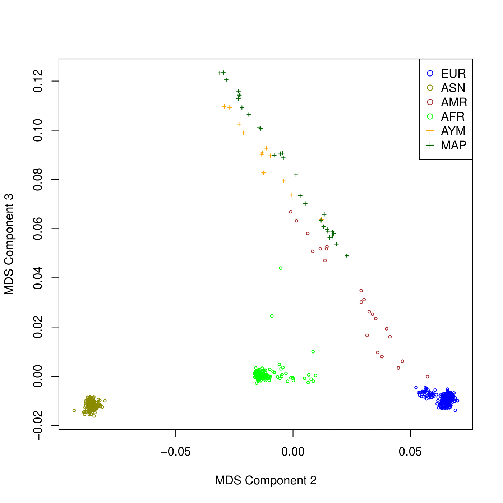
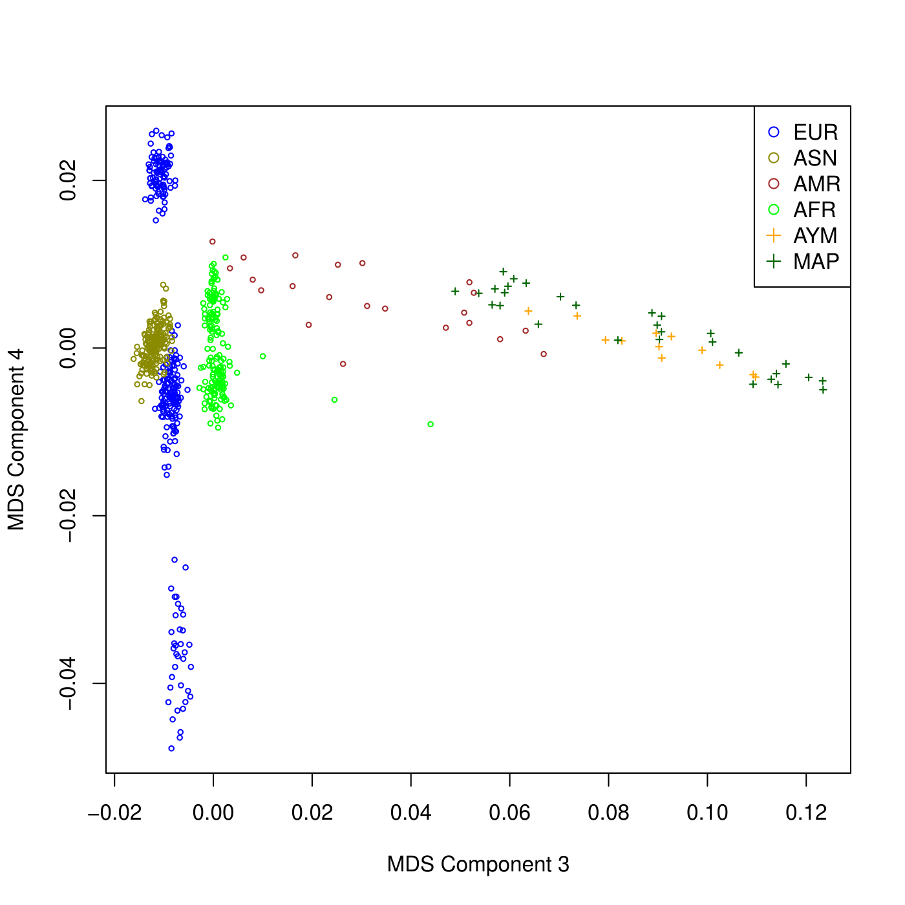

# Respuestas a Tarea05

**Autor:** Samuel Jorquera

Respuestas a la tarea05.

## Parte 1: Análisis de control de calidad

### Paso 1

1. ¿Cómo se llaman los archivos que contienen las tasas de datos perdidos por SNP y por muestra?

Esos corresponden a los archivos terminados en ```.imiss``` y ```.lmiss```. En este caso particular, no se entrega ningún archivo de destino, por lo que los archivos generados son ```plink.imiss``` y ```plink.lmiss```.

2. ¿Cuántas variantes se eliminaron por tener una tasa de datos perdidos mayor a 0.2?

Los comandos utilizados para filtrar la pérdida de datos mayor a 0.2 fueron:

```bash
plink --bfile $C/chilean_all48_hg19 --geno 0.2 --make-bed --out chilean_all48_hg19_2
plink --bfile chilean_all48_hg19_2 --mind 0.2 --make-bed --out chilean_all48_hg19_3
```

Una vez terminado el segundo comando, se indica lo siguiente:

```bash
Total genotyping rate is 0.991846.
808686 variants and 48 people pass filters and QC.
Among remaining phenotypes, 0 are cases and 48 are controls.
--make-bed to chilean_all48_hg19_3.bed + chilean_all48_hg19_3.bim +
chilean_all48_hg19_3.fam ... done.
```
Siendo 813366 las variantes iniciales, se eliminaron 4680 variantes por pérdidas de datos

3. ¿Cuántos individuos tenían una tasa de datos perdidos mayor a 0.02?

Nuevamente, los comando utilizados para un segundo filtrado en, esta vez con 0.02 como umbral máximo, fueron:

```bash
plink --bfile chilean_all48_hg19_3 --geno 0.02 --make-bed --out chilean_all48_hg19_4
plink --bfile chilean_all48_hg19_4 --mind 0.02 --make-bed --out chilean_all48_hg19_5
```

Lo que entregó al final el siguiente output:
```bash
31640 MB RAM detected; reserving 15820 MB for main workspace.
574624 variants loaded from .bim file.
48 people (27 males, 21 females) loaded from .fam.
48 phenotype values loaded from .fam.
0 people removed due to missing genotype data (--mind).
```

Por lo que se mantuvieron 48 individuos de los iniciales. Por lo que finalmente se indica que no hubo individuos descartados por pérdida de datos.

4. Basados en los histogramas y en sus cálculos, ¿qué valores umbrales de datos perdidos para muestras y SNPs sugeriría?

Finalmente, se encuentra que 0.02 es un umbral decente, al permitir descartar una gran cantidad de variantes con información pérdida, sin descartar a ningún individuo.


### Paso 2
1. ¿Cuántos individuos fueron eliminados por discrepancia de sexo?

En esta parte se aplica el siguiente comando:
```bash
plink --bfile chilean_all48_hg19_5 --remove sex_discrepancy.txt --make-bed --out chilean_all48_hg19_6 
```

Lo que entrega el siguiente output
```bash
48 phenotype values loaded from .fam.
--remove: 45 people remaining.
Using 1 thread (no multithreaded calculations invoked).
Before main variant filters, 45 founders and 0 nonfounders present.
Calculating allele frequencies... done.
Warning: 7602 het. haploid genotypes present (see chilean_all48_hg19_6.hh );
many commands treat these as missing.
574624 variants and 45 people pass filters and QC.
```

Por lo que se eliminaron 3 individuos por discrepancia.

2. ¿Qué riesgo(s) se corre(n) si no se eliminaran?

El principal riesgo de la discrepancia de sexo, es la poca confiabilidad del dato. Ésto pues, el sexo debería ser, en principio, un dato sin errores. Las discrepancias pueden indicar que el dato fue registrado de manera incorrecta. No eliminarlos puede contaminar la muestra.


### Paso 3: Filtrado de SNPs

1. ¿Cuál es el nombre del primer conjunto de datos que solo contiene SNPs en autosomas?

En este caso se le puso el nombre de snp_1_22.txt. Este archivo contiene una lista de una única columna, donde cada línea es un SNP autosomal.

Por otro lado, la información genética para todos los individuos queda planteada en el archivo ```chilean_all48_h19_7.bim```

3. ¿Cuántos SNPs se encontraban en cromosomas sexuales?

El comando ejecutado consiste en:
```bash
plink --bfile chilean_all48_hg19_6 --extract snp_1_22.txt --make-bed --out chilean_all48_hg19_7
```

Luego, el output indica que:

```bash
574624 variants loaded from .bim file.
45 people (26 males, 19 females) loaded from .fam.
45 phenotype values loaded from .fam.
--extract: 557922 variants remaining.
Warning: At least 134 duplicate IDs in --extract file.
Using 1 thread (no multithreaded calculations invoked).
Before main variant filters, 45 founders and 0 nonfounders present.
Calculating allele frequencies... done.
557922 variants and 45 people pass filters and QC.
```
Donde luego del filtrado de variantes en cromosomas sexuales, quedan 557922 variantes autosomales. Por lo tanto, se concluye que hay 16702 SNPs en cromosomas sexuales

3. ¿Como calcularía el número de cromosomas que porta cada uno de los alelos para cada SNP?

...


### Paso 4: Borrar SNPs por filtro de HWE

1. ¿Cuál es el nombre del archivo con los resultados de la prueba de HWE?

El comando:
 
```bash
plink --bfile chilean_all48_hg19_8 --hardy
```

Calcula el p value de la prueba HWE de cada uno de los snps. Éste entrega un archivo de nombre ```plink.hwe```, que contiene información respecto a las frecuencias, a la cantidad de individuos homo y heterocigóticos, y el pvalue de HWE test

2. ¿Basándose en la distribución de los valores de p, le parece el umbral usado razonable o propondría otro valor?

A nivel general, se aprecia que la mayoría de SNPs se encuentran con un HWE aceptable muy cercano a 1. Por otro lado, de un p-value entre 0 y 0.8, se observa que las variables distribuyen homogéneamente.

Por lo tanto, considero que el umbral está razonablemente escogido

### Paso 5: Eliminar parentescos desconocidos

1. ¿Cuántos SNPs en aparente equilibrio de ligamiento se encontraron?

Luego de emplear el comando
```bash
plink --bfile chilean_all48_hg19_9 --exclude $T/inversion.txt --range --indep-pairwise 50 5 0.2 --out indepSNP
```

Se entrega el siguiente log.

```bash
Pruning complete.  346968 of 450182 variants removed.
Marker lists written to indepSNP.prune.in and indepSNP.prune.out .
```

Es decir, 346968 variantes estaban en LD

2. ¿Cuántos SNPs se eliminaron por estar en regiones de inversiones conocidas?

Gracias a la flag ```--range```en el comando anterior, se señala directamente lo siguiente:

```bash
45 phenotype values loaded from .fam.
--exclude range: 7915 variants excluded.
```

Es decir, 7915 variantes fueron eliminadas de regiones conocidas.

3. ¿Cuántos individuos quedaron luego del filtro de parentesco?
En particular, el primer filtro se realiza mediante pi_hat >0.2:

```bash
plink --bfile chilean_all48_hg19_9 --extract indepSNP.prune.in --genome --min 0.2 --out pihat_min0.2
```

Donde, al analizar el log, se encuentra que:

```bash
45 phenotype values loaded from .fam.
--extract: 103220 variants remaining.
Using up to 15 threads (change this with --threads).
Before main variant filters, 45 founders and 0 nonfounders present.
Calculating allele frequencies... done.
103220 variants and 45 people pass filters and QC.
```

Por lo que luego de este primer filtro, se analizan sujetos que generan problemas de parentesco para elimiarlos de manera manual:

```bash
plink -bfile chilean_all48_hg19_9 -remove to_romeve_by_relatedness.txt -make-bed --out chilean_all48_hg19_10
```

Por lo que se eliminan particularmente 3 individuos: ```ARI001```, ```ARI021``` y ```ARI018```


4. ¿Cuál fue el mayor coeficiente de parentesco efectivamente aceptado?

Por último, se puede observar directamente el menor valor pi_hat aceptado (como son pocos individuos lo podemos hacer observando directamente los datos (```nano pihat_min0.2.genome```):

```
   ARI023   ARI023   ARI001   ARI001 UN    NA  0.4149  0.5851  0.0000  0.2925  -1  0.785744  1.0000  4.7987
   ARI015   ARI015   ARI001   ARI001 UN    NA  0.4471  0.5529  0.0000  0.2765  -1  0.788268  1.0000  4.3029
   ARI001   ARI001  CDSJ048  CDSJ048 UN    NA  0.4387  0.5613  0.0000  0.2807  -1  0.783603  1.0000  4.9320
   ARI001   ARI001  CDSJ108  CDSJ108 UN    NA  0.4685  0.5315  0.0000  0.2658  -1  0.787691  1.0000  3.9428
   ARI001   ARI001  CDSJ167  CDSJ167 UN    NA  0.5396  0.4604  0.0000  0.2302  -1  0.772375  1.0000  3.6229
   ARI001   ARI001  CDSJ106  CDSJ106 UN    NA  0.4814  0.5186  0.0000  0.2593  -1  0.785453  1.0000  3.8446
   ARI001   ARI001   ARI014   ARI014 UN    NA  0.4493  0.5507  0.0000  0.2753  -1  0.786151  1.0000  4.6974
   ARI001   ARI001  CDSJ032  CDSJ032 UN    NA  0.5158  0.4842  0.0000  0.2421  -1  0.776468  1.0000  4.0501
   ARI001   ARI001  CDSJ321  CDSJ321 UN    NA  0.4863  0.5137  0.0000  0.2569  -1  0.783283  1.0000  3.7241
   ARI001   ARI001   ARI008   ARI008 UN    NA  0.4230  0.5770  0.0000  0.2885  -1  0.786214  1.0000  4.7712
   ARI001   ARI001  CDSJ344  CDSJ344 UN    NA  0.4601  0.5399  0.0000  0.2700  -1  0.782949  1.0000  4.0793
   ARI001   ARI001   ARI019   ARI019 UN    NA  0.4071  0.5929  0.0000  0.2964  -1  0.791426  1.0000  4.4054
   ARI001   ARI001  CDSJ417  CDSJ417 UN    NA  0.4855  0.5145  0.0000  0.2572  -1  0.778512  1.0000  4.3631
   ARI008   ARI008   ARI019   ARI019 UN    NA  0.6189  0.3611  0.0200  0.2005  -1  0.837686  1.0000  3.3516
```

Por lo que el mayor parentesco aceptado es entre ARI008 y ARI0019 (0.2005).


## Parte 3: Análisis de estructura poblacional

### Paso 3: Graficar resultados de MDS

1. En R, genere gráficos similares para las combinaciones Component 2 vs 3 y 3 vs 4. ¿Qué puede concluir de estos gráficos?

Se puede modificar directamente el archivo ```MDS_merged.R```. En particular, se crearon los archivos:
- ```MDS_merged2.R```: Genera gráficos con componentes 2 y 3 
- ```MDS_merged3.R```: Genera gráficos con componentes 3 y 4

Ambos pueden ser encontrados en [**bin**](../bin/). Particularmente, los cambios se realizan sobre la linea
```
plot(datafile[,4],datafile[,5],type="p", xlab="MDS Component 1", ylab="MDS Component 2",pch=datafile$pch, cex=0.5, col=datafile$color)
``` 

Siendo datafile[.4] el eje x, correspondiente al componente 1, [,5] al 2, y así sucesivamente. Por lo que basta con cambiar esta línea para obtener las otras figuras. Por ejemplo, para ```MDS_merged2.R```:

```
plot(datafile[,5],datafile[,6],type="p", xlab="MDS Component 2", ylab="MDS Component 3",pch=datafile$pch, cex=0.5, col=datafile$color)
```

Obteniendo la figura 2:



Y la 3:



### Paso 4: Realizar un análisis de Ancestría

1. ¿Cuántos SNPs quedaron luego del filtro?

Aplicando el comando:

```bash
plink --bfile MDS_merge --extract indepSNP.prune.in --make-bed --out MDS_merge_r2_lt_0.2
```

Revisando el log, se indica que:

```
Total genotyping rate is 0.99949.
70534 variants and 671 people pass filters and QC.
Among remaining phenotypes, 0 are cases and 42 are controls.  (629 phenotypes
are missing.)
```

Por lo que quedan 70534 variantes.


