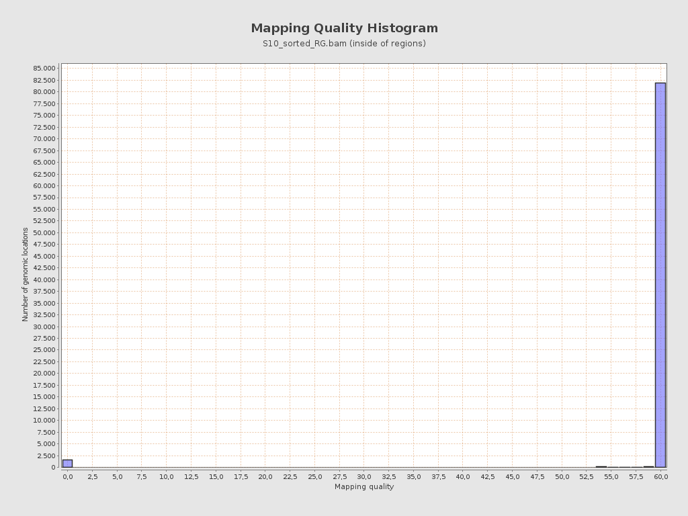
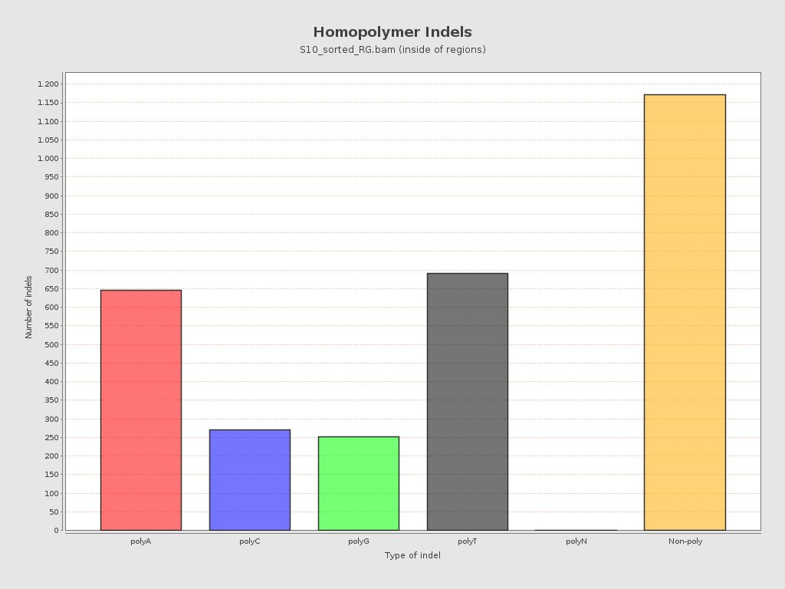
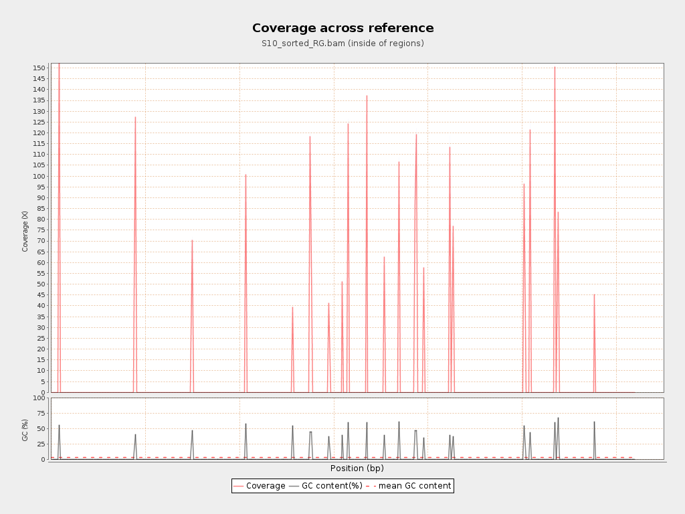
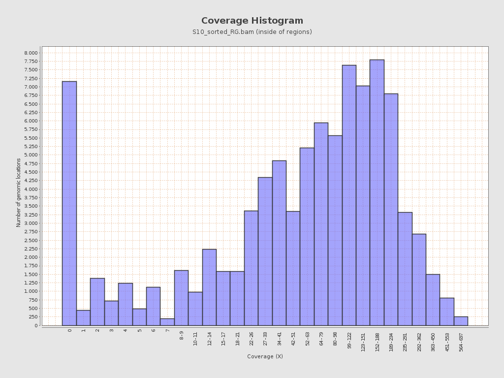

# Parte 1 de Tarea 3.3: Alineamiento de secuencias.
**Autor**: Samuel Jorquera

1. Realizar el alineamiento contra el genoma humano hg19 de las lecturas R1 y R2 del paciente seleccionado para la tarea de control de calidad de lecturas de secuencia.

Para esta parte, basta con seguir los pasos planteados en el repositorio github

---------

2. Utilizando una línea de comando, encuentre la primera lectura en el archivo SAM que contenga bases enmascaradas (secuencias suavizadas por soft-clipping)

Esto se puede resolver en 3 pasos:
	
i) Eliminar los encabezados (comienzan con @): ```grep -v '^@'```

ii) Filtrar con awk la 6 fila para aquellas que contengan S: ```awk '$6 ~ /S/'```

iii) Obtener la primera linea: ```grep -m 1 ''```

Así, se obtiene que el comando a utilizar es:

```
grep -v '^@' S10.sam | awk '$6 ~ /S/' | grep -m 1 '' > first_soft-clipping.txt
```
Finalmente, queda guardado en el archivo de texto ```first_soft-clipping.txt```

---------
3. Muestre el registros de la lecturas en el archivo SAM e identifique y explique el código CIGAR de esa lectura.

Leemos ```first_soft-clipping.txt```:

```
first_soft-clipping.txt" 1L, 635C                                                                                                                                                M03564:2:000000000-D29D3:1:1101:15395:1593	83	chr11	32456388	60	20S231M	=	32456388	-231	#seq	NM:i:0	MD:Z:231	MC:Z:134M	AS:i:231	XS:i:23
```

La sexta linea consiste en el CIGAR: ```20S231M```, lo que se traduce en que los primeros 20 nucleótidos son de soft-clipping, y los siguientes 231 son lecturas sin gap (no necesariamente coinciden con la referencia).

---------
4. Generar un reporte técnico de calidad del alineamiento con qualimap.

Para generar un reporte técnico, basta con ejecutar el comando planteado en el repositorio:
```
qualimap bamqc -bam S10_sorted_RG.bam -gff ~/181004_curso_calidad_datos_NGS/regiones_blanco.bed -outdir ./S10_sorted_RG
```

Lo que generará la carpeta ```S10_sorted_RG```, que contendrá un reporte de calidad adecuado, el que se puede encontrar en [anexo](../data/S10_sorted_RG/qualimapReport.html)

---------
5. Seleccionar 4 figuras que a su juicio sean las más informativas sobre la calidad de los datos y del ensamble.

Se observa que la enorme mayoría de las lecturas tiene una calidad de 60 o superior:



Se observa también que el 61.33% de INDELs son homopolímeros (es decir, corresponden a una única base nitrogenada repetida 2 o más veces). Entre ellas polyA y polyT son los más comunes:



Respecto a la cobertura, se observa que, efectivamente, en las regiones mapeadas, la cobertura tiene un promedio de 102. En la siguiente figura se observa las regiones mapeadas junto a la cobertura:



Y en la siguiente figura se presenta un histograma de la cobertura para las distintas regiones mapeadas:




---------
6. Incluir las figuras en la sección de Resultados de un reporte técnico. Describir cada figura con una leyenda descriptiva. Adicionalmente, en el texto de la sección, interpretar los resultados y citar cada figura. Debe referirse a la calidad de los datos y del alineamiento. Enfóquese especialmente en los posibles problemas con los datos o alineamientos. Comente potenciales razones que expliquen lo observado. Incluya una sección con las principales Conclusiones para la muestra.

El reporte técnico puede ser encontrado en [El siguiente archivo](Alignment_QR.md) en formato markdown.

---------
7. Incluya el reporte completo generado con qualimap como anexo.

El reporte de calidad generado por qualimap se puede encontrar en [anexo](../data/S10_sorted_RG/qualimapReport.html) en formato html.
