# Tarea 3.4
**Autor**: Samuel Jorquera

Este archivo contiene la resolución a la tarea correspondiente al Tutorial 1 del uso del Software CLC: "Identification of Variants in a Tumor Sample". Éste consiste en la identificación de variantes presentes en el cromosoma 5 de una muestra de tumor. Los datos provienen desde una secuenciación de exoma completo (WES).


## Importación de datos
Se obtienen los datos desde el archivo online [https://resources.qiagenbioinformatics.com/testdata/Example_data_tumor_25.zip.](https://resources.qiagenbioinformatics.com/testdata/Example_data_tumor_25.zip.)

Luego, los archivos se importan de manera estándar, quedando almacenados en el directorio ```CLC_data```.

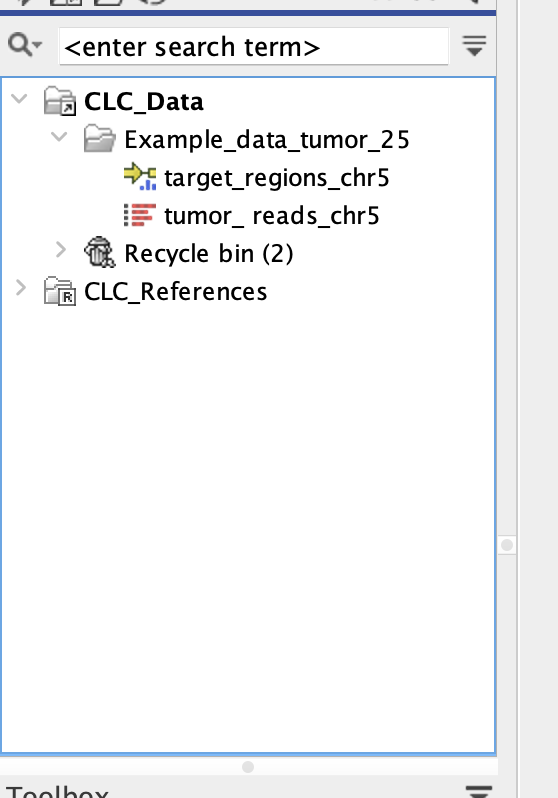

**Figure 1:** Import of data in the CLC software


## Identificación de Variantes

El Workflow corriente de identificación de variantes se encuentra implementado en CLC, por lo que basta con hacer entregar un input, en este caso, el archivo correspondiente a los reads:

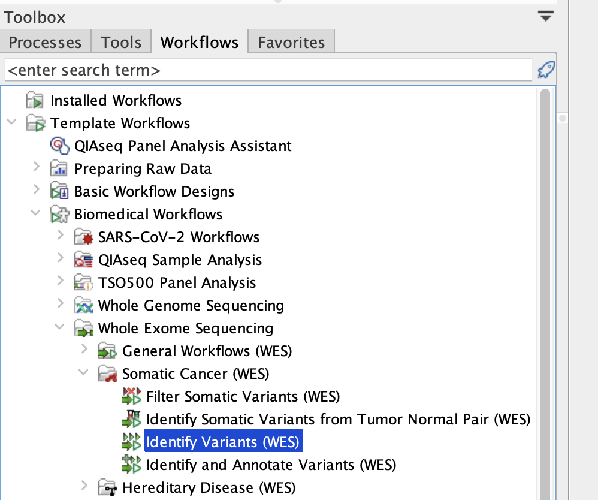

**Figure 2:** Tool used for WES analyses 


Desde acá, se prosigue normalmente con el tutorial. Cuando llegamos a la función "Low Frequency Variant Detection", hay que poner atención a modificar el MAF de 1.0% a 5.0%:

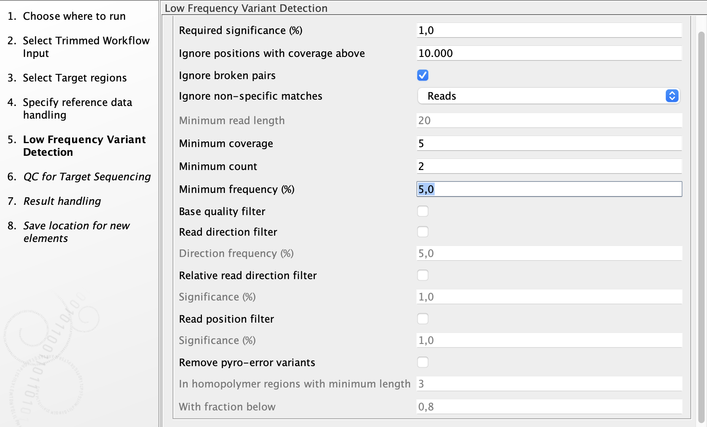

**Figure 3:** Options for MAF filtrarion

Luego, se debe cambiar la cobertura mínima de 30 a 10 (ver tutorial).

Finalmente, se debe elegir una carpeta para guardar los resultados, en este caso, se crea una nueva carpeta en ```CLC_data/WES_var_results/```.

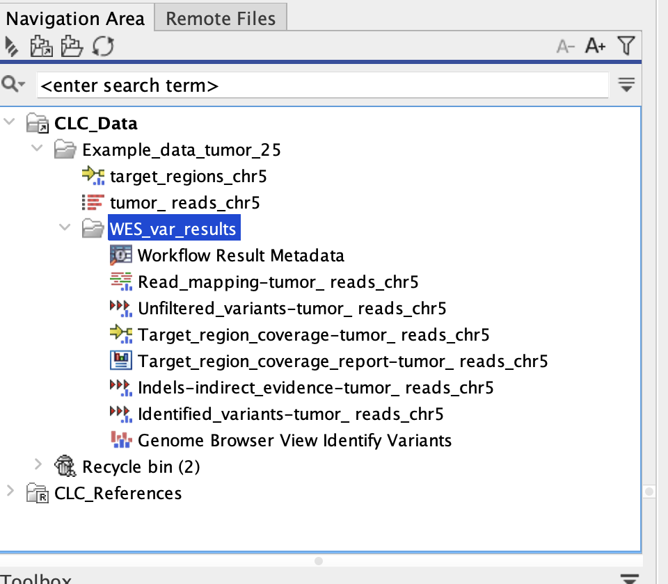

**Figure 4:** Files created by variant analysis of CLC software


## Control de calidad

El control de calidad consiste en verificar las siguientes características:

1. La cobertura promedio en las regiones objetivo es suficiente?
2. La especifidad de las lecturas mapeadas hacia la región objetivo está en los rangos esperados?
3. Están los objetivos específicos suficientemente cubiertos?


Así, las respuestas a estas preguntas se pueden verificar siguiendo el tutorial:

----

**Cobertura promedio**:

Esto puede ser revisado en ```Target_region_coverage_report-tumor_reads_chr5```. En este caso, planteamos la cobertura mínima de 10, por lo que claramente esperamos tener una cobertura promedio superior a 10, lo que se considera suficiente en este contexto. Esto puede ser observado en la sección ```summary``` del archivo antes planteado:


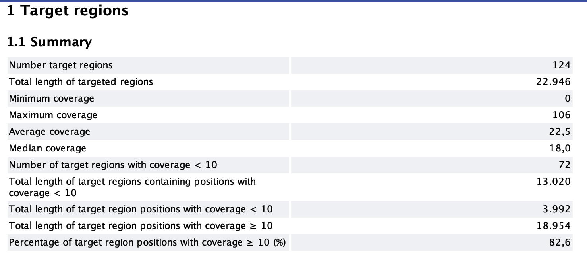

**Figure 5:** Summary of variants and mapping

Finalmente, la cobertura promedio es de 22.5, por lo que este aspecto es suficiente.

-----

**Especificidad de mappeo**:


Nuevamente, se puede revisar en ```Target_region_coverage_report-tumor_reads_chr5```. En general, para un mapping completo se espera una especificidad mínima de 50%. En este caso, dado que estamos trabajando en una región específica del genoma, es esperable que este número sea menor, considerando que algunas lecturas no están siendo mapeadas en sus regiones esperadas. Se observa una especificidad de 36,48%.

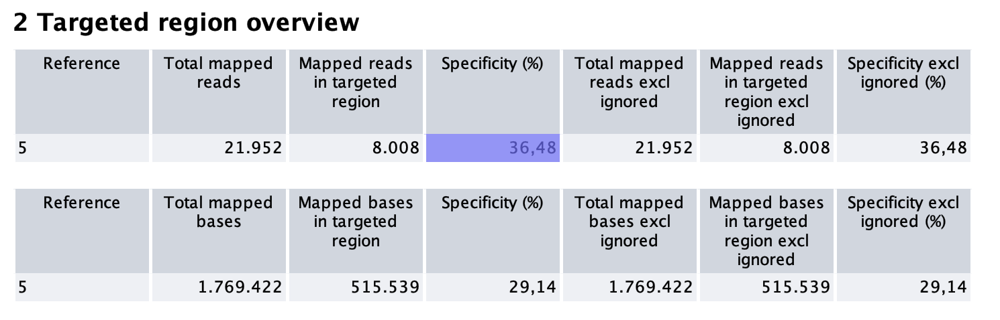

**Figure 6:** Specificity of mapping


-----

**Cobertura en objetivos específicos**

Acá, queremos observar si aquellos reads mappeados específicamente presentan una buena cobertura, pues al fin y al cabo, esta información es la que tendrá más impacto y podrá generar mayor conclusiones.

Nuevamente, se puede revisar en ```Target_region_coverage_report-tumor_reads_chr5```:

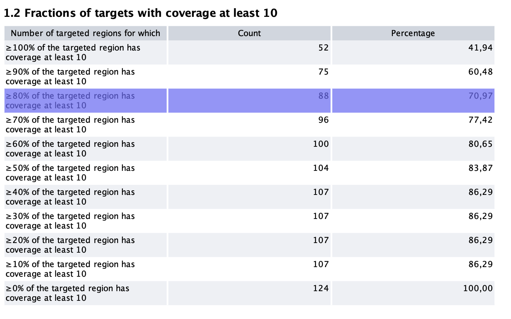

**Figure 7:** Coverage in specific targets


Acá, observamos que el el 60.48% de las regiones con especificidad superior al 90% presenta cobertura superior a 10. Mientras que para las regiones de especificidad >80%, al menos el 70% presenta esta cobertura.

-----

Finalmente, se puede conlcuir que hay una calidad adecuada considerando que estamos trabajando exclusivamente en el cromosoma 5.


## Identificación de falsos positivos

En primer lugar, la cantidad de variantes identificadas es 16:


**Figure 8:** Identified variants

Así, se pueden filtrar variantes identificadas. Primero, se filtran hacia aquellas que no contienen un alelo de referencia:

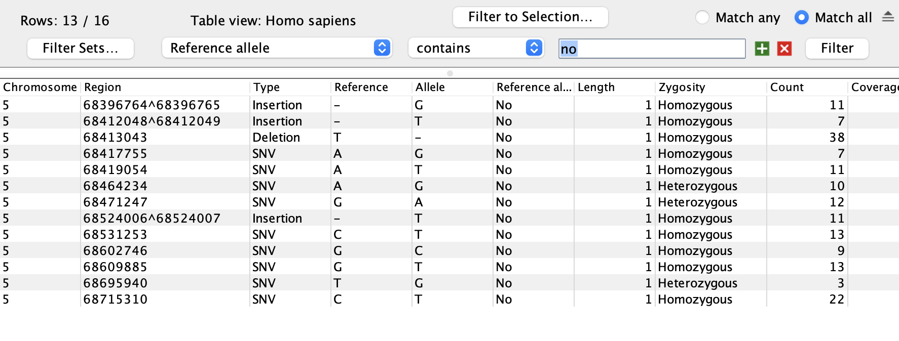

**Figure 9:** Variants filtering by reference allele


Luego, podemos filtrar a variantes con una frecuencia baja, pues esta son las que representan un mayor interés. Sin embargo, es complejo diferenciar estas variantes de aquellas correspondientes a errores de secuenciación. Por lo tanto, hay que tener en cuentra otras cosas. Se seleccionan variantes <50% de frecuencia:

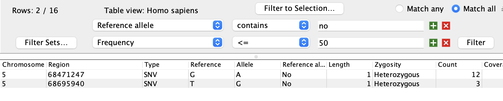

**Figure 10:** Filtering by frequency


Finalmente, obtenemos 2 variantes SNVs, una en particular con frecuencia 25%. Sin embargo, su cobertura es de 12, por lo que no es muy considerable. Luego, otra variante con frecuencia 48% tiene cobertura 25. Además, está apoyada por 12 lecturas, y 11 lecturas únicas. Por lo que esta variantes es considerable.

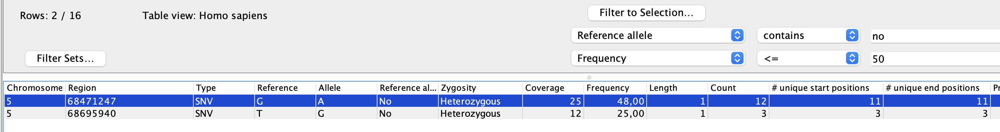

**Figure 11:** Final variants after filtering


Así, finalmente se identifica a la variante ```5:68471247 G>A```.

## Variante

Se busca la variante en gnomAD, y se encuentra que es sinónima Leu>Leu en el gen CCNB1, de modo que es poco posible que sea un gen interesante. Además, esta variante no puede ser encontrada en oncoKB.

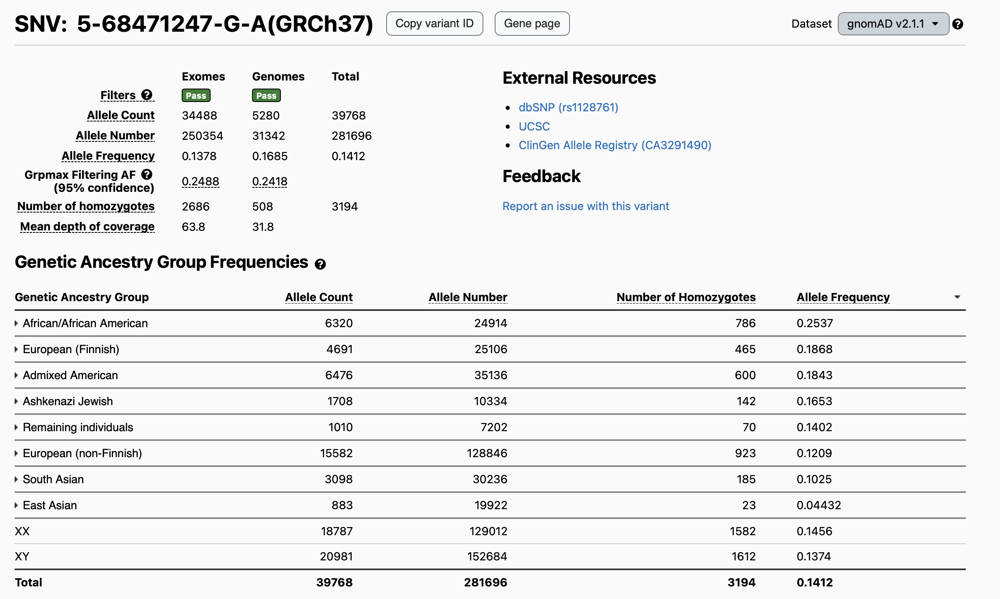

**Figure 12:** Variant ```5:68471247 G>A```.

Por otro lado, se aprecian 2 variantes interesantes de estudiar:

1. ```5:68464234 A>G```: Posee una frecuencia de 58.82%, y una cobertura de 17, que es menor a lo planteado, pero que permite estudiarla.
2. ```5:68412048 INS T``: Variante con un 97.44% de frecuencia y cobertura de 37

La primera, corresponde a una variante intrónica, que tampoco puede ser observada en oncoKB, y no está indentificada como patogénica

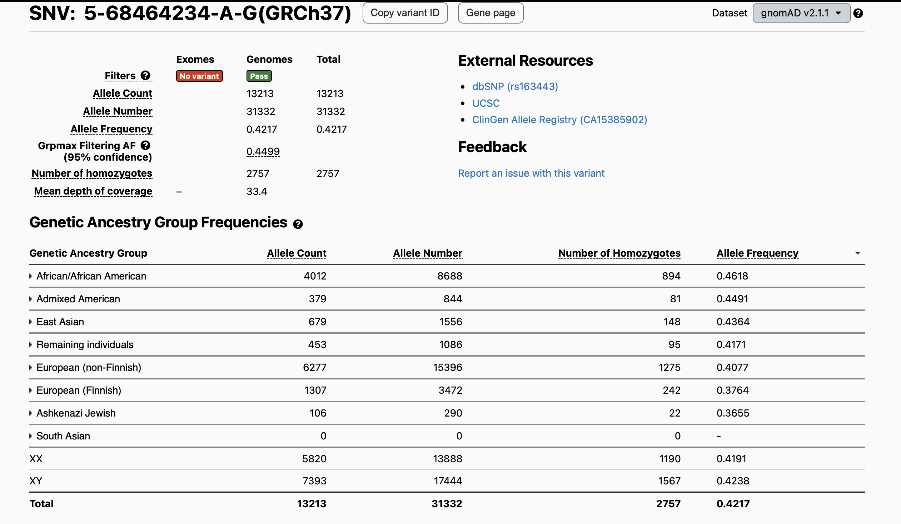

**Figure 13:** Variant ```5:68464234 A>G```.

Mientras que la segunda, se encuentra en una región de splicing, y tampoco está identificada como patogénica ni está presente en la base de oncoKB

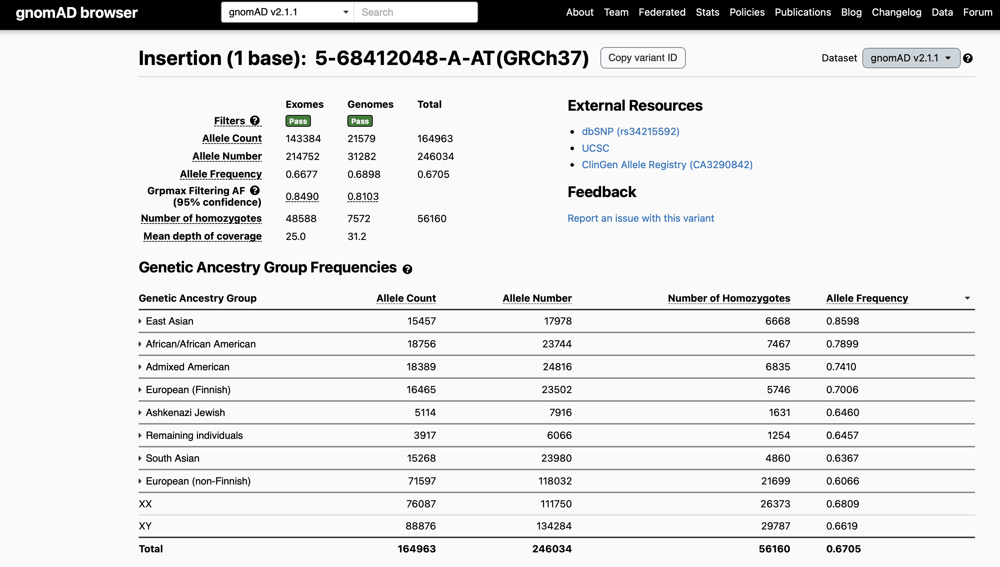

**Figure 14:** Variant ```5:68412048 INS T```.


## Conclusiones

Así, se concluye que las variantes identificadas no están asociadas con oncogénesis, y por lo tanto se requiere profundizar en el resto de cromosomas para identificar variantes que puedan estar asociadas con el desarrollo de neoplasia en los pacientes secuenciados.


