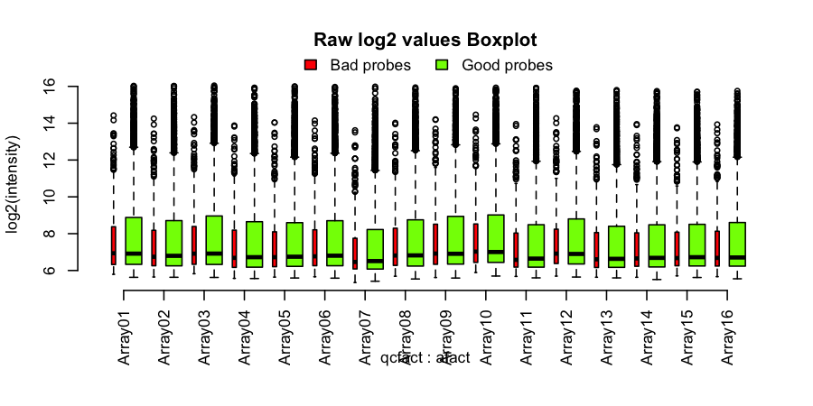
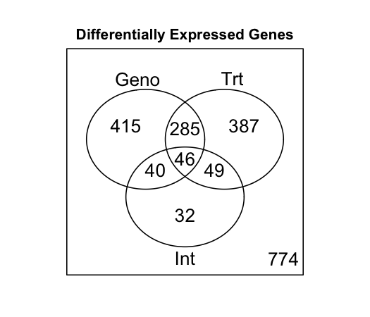
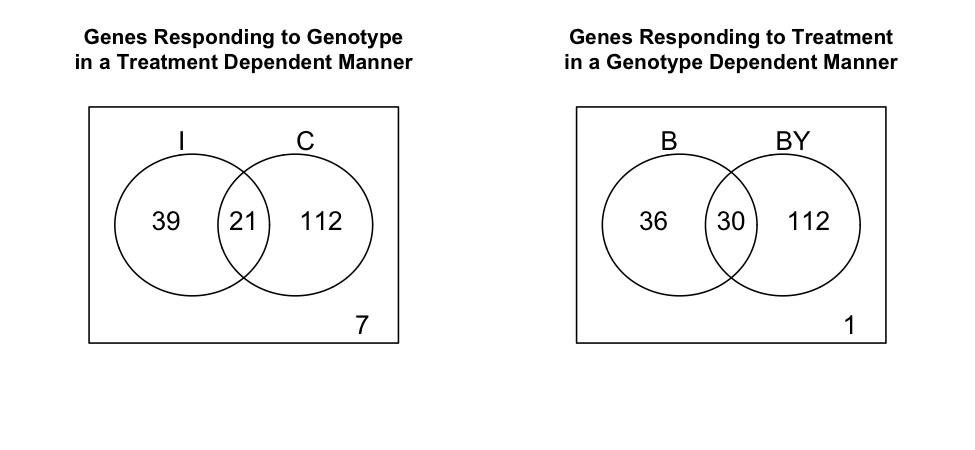

# Tarea 4.1
**Autor**: Samuel Jorquera

En el presente informe se encuentra la resolución de la Tarea 1 de la unidad 4. El código de R ejecutado se encuentra en el archivo [DE-UNIX](../code/DE-UNIX.R). Los resultados del análisis se encuentran en el directorio [results](../results/).

En primer lugar, se trabajó sobre 5000 lecturas de las ~25000 presentes en el archivo ```Illum_data.txt```. Para ello, se escogieron 5000 muestras aleatorias usando el comando ```gshuf``` del paquete ```coreutils```:

```bash
{ head -n 1 code/DE_tutorial/Illum_data.txt; tail -n +2 code/DE_tutorial/Illum_data.txt | gshuf -n 5000; } > code/Illum_data_sample_SJA.txt
```

Este comando no es reproducible, pues no cuenta con una semilla para el randomizado. Sin embargo, en este caso sólo nos interesa obtener una muestra aleatoria. Así, quedamos con el archivo [Illum_data_sample_SJA.txt](../code/Illum_data_sample_SJA.txt), que contiene 5000 lineas aleatorias.

## Análisis DE

Seguimos con la ejecución del análisis DE. En particular, se hará referencia a los cambios con respecto al archivo original.

En primer lugar, queremos que los resultados vayan al directorio [../results/](../results/):

```R
outdir     <- "../results"
```

El archivo de lectura cambia a

```R
Data.Raw  <- read.delim("Illum_data_sample_SJA.txt")
```

Dado que cambiaron las lineas usadas, también debemos actualizar la anotación de genes:

```R
annot     <- read.delim("MouseRef-8_annot_full.txt")
```

Haciendo match, encontramos la siguiente cantidad de genes con un buen match respecto a la información de anotación:

```R
        Bad        Good     Good***    Good****    No match     Perfect  Perfect*** Perfect**** 
        275         102           2          23          12        4424          41         121
```

Por lo que, finalmente agrupando ```Bad``` y ```No match``` como ```Bad probes```, y el resto como ````Good probes``` nos quedamos con:

```R
 Bad probes Good probes 
        287        4713 
```

Siguiendo, se puede graficar la calidad de las mediciones del ensayo de manera cruda para cada microarray (total 16):


**Figura 1**: Boxplot de calidad de datos no procesados por microarray. Se presenta para aquellas sondas alineadas correctamente, y aquellas que no, proporcional a la cantidad.

Acá, encontramos en primer lugar una calidad adecuada para todas las muestras. Se señala que los primero microarrays deberían tener una mejor calidad, en contraste con los últimos, debido a defectos propios de la técnica y del equipo –es decir, a lo largo del eje X, debería ir disminuyendo–. Sin embargo, para esta muestra local de 5000, esto no es claramente observado. Así, se concluye que la calidad de las lecturas correctas es suficiente.

Se obtienen otras figuras respecto a la [calidad por grupo de tratamiento](../results/boxplot_raw_treatment.png) y la [disepersión de los datos log2](../results/Pairs_scatter_log2.png). De ambos, se concluye nuevamente una calidad adecuada


Siguiendo, pasamos al filtrado de sondas en función de la cantidad de grupos que la hayan observado. En el archivo original, este límite se planteó como que en al menos 1 grupo se haya detectado el 50% de las veces (es decir, al menos 1 grupo lo mida 2 veces). Acá el límite se cambia a que al menos el 25% de **cada grupo** (es decir, al menos 1 por grupo) lo presente. Para ello, se deben ejecutar los siguientes comandos.

```R
probe_present      <- Data.Raw[,detection] < 0.04
detected_per_group <- t(apply(probe_present, 1, tapply, design$Group, sum))
present  <- apply(detected_per_group >= 1, 1, all)
normdata <- normdata[present,]
annot    <- annot[present, ]
```

En particular, la linea ```present  <- apply(detected_per_group >= 1, 1, all)``` incluye los cambios, al poner el límite en ```>=1``` y que sea ```all``` en  vez de any. Así, nos quedamos con 2161 sondas (en el original se quedaban con 2308).

Luego, seguimos con la ejecución de manera regular. Hasta que llegamos a la prueba de contrastes, las que ejecutamos con 500 permutaciones:

```R
> # Test each contrast using 500 permutations of sample labels
> test.cmat <- matest(madata, fit.fix, term="Group", Contrast=cmat, n.perm=500, test.type = "ttest",
+                  shuffle.method="sample", verbose=TRUE)
Doing F-test on observed data ...
Doing permutation. This may take a long time ... 
Finish permutation #  100 
Finish permutation #  200 
Finish permutation #  300 
Finish permutation #  400 
Finish permutation #  500 
```

Finalmente, de la prueba anterior, nos quedamos con el p-value calculado desde la permutación con la prueba F con contracción de la varianza ```Fs Pvalperm```. Y ajustamos por FDR, considerando una tasa de descubrimiento de falsos aceptables de 0.19. Éste es un parámetro que se define incialmente al ejecutar el código:

```R
fdr_th     <- 0.19
```

Adicionalmente, al seleccionar genes para el conteo de DEGs, modificamos el filtrado desde aquellos genes que presentan transcritos en al menos un grupo, a que lo presenten todos los grupos. Así, ambas líneas quedan:

```R
Probes.DE <- results[, c("FDR.Geno", "FDR.Trt", "FDR.Int")]  <= fdr_th
Genes.DE  <- apply(Probes.DE, 2, tapply, results$GeneID, all)
```

Modificándose por el valor ```fdr_th``` a 0.19, y por la opción ```all``` en vez de any en ```apply()```. El siguiente diagrama de Venn representa DEGs según tratamiento, efectos, o ambos.



**Figura 2**: Genes diferencialmente expresados por efecto del genotipo, del tratamiento, o por una interacción entre ambos.


Lo mismo aplica para la búsqueda de genes de interacción para el genotipo (```Genes.Int_Geno```) y tratamiento (```Genes.Int_Trt```). El siguiente diagrama de Venn resume DEGs producto de interacción con tratamiento, genotipo, o ambos.



**Figura 3**: Genes diferencialmente expresados por efecto de la interacción. Se representa la interacción del genotipo con los tratamientos (Diagrama izquierda; I: control, C: Castrados), y la interacción del tratamiento con los genotipos (Diagrama derecha; B: ratón WT, BY: cepa de estudio).

Acá, observamos que para la interacción del genotipo con los tratamientos, la mayoría de los efectos se observan sobre el grupo intervenido. Así mismo, con respecto al grupo de estudio BY en la interacción con el tratamiento. Éste resultado es similar al observado en el tutorial, y al correspondiente al trabajo original.

Finalmente, podemos hacer ensallos de enriquecimiento, funcional. Siguiendo el tutorial, encontramos para este subset de genes DEG lo siguiente:

```R
        GO.ID                                        Term Annotated Significant Expected
1  GO:0051017              actin filament bundle assembly        20           8     1.80
2  GO:0045446            endothelial cell differentiation        16           6     1.44
3  GO:0001894                          tissue homeostasis        35           9     3.15
4  GO:0035295                            tube development       126          21    11.34
5  GO:0050772         positive regulation of axonogenesis         8           4     0.72
6  GO:0060560 developmental growth involved in morphog...        24           7     2.16
7  GO:0033143 regulation of intracellular steroid horm...        13           5     1.17
8  GO:0001934 positive regulation of protein phosphory...        89          16     8.01
9  GO:0022600                    digestive system process         9           4     0.81
10 GO:0031958 corticosteroid receptor signaling pathwa...         5           3     0.45
11 GO:0043067         regulation of programmed cell death       214          30    19.26
12 GO:0016477                              cell migration       179          26    16.11
13 GO:0007155                               cell adhesion       128          20    11.52
14 GO:0048639 positive regulation of developmental gro...        21           6     1.89
15 GO:0000245               spliceosomal complex assembly        10           4     0.90
16 GO:0009410             response to xenobiotic stimulus        34           8     3.06
17 GO:0044087 regulation of cellular component biogene...       147          22    13.23
18 GO:0007611                          learning or memory        28           7     2.52
19 GO:0070887      cellular response to chemical stimulus       346          46    31.13
20 GO:0050890                                   cognition        34          10     3.06
   Rank in Fisher.classic Fisher.classic Fisher.elim
1                       1        0.00018     0.00018
2                       8        0.00182     0.00182
3                      11        0.00283     0.00283
4                      13        0.00315     0.00315
5                      14        0.00332     0.00332
6                      18        0.00391     0.00391
7                      19        0.00394     0.00394
8                      22        0.00460     0.00460
9                      27        0.00557     0.00557
10                     29        0.00625     0.00625
11                     32        0.00677     0.00677
12                     34        0.00737     0.00737
13                     36        0.00838     0.00838
14                     38        0.00840     0.00840
15                     42        0.00863     0.00863
16                     43        0.00863     0.00863
17                     49        0.00963     0.00963
18                     50        0.00983     0.00983
19                      9        0.00213     0.01017
20                      4        0.00052     0.01085
```

Observamos con respecto al tutorial que algunos de las vías se repiten, como por ejemplo ```positive regulation of protein phosphory```. Sin embargo, los resultados difieren, de modo que no tiene mucho sentido realizar este análisis para únicamente 50000 sondas, y no para el estudio completo.


