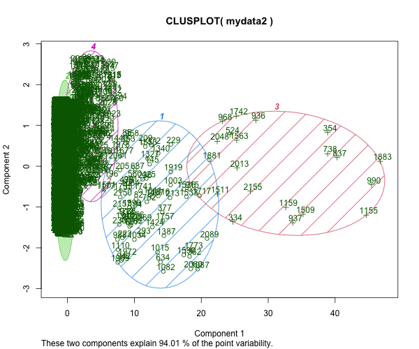
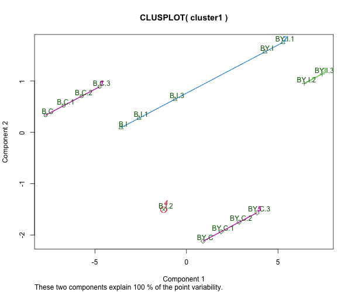
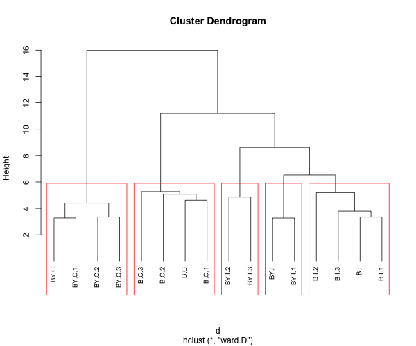
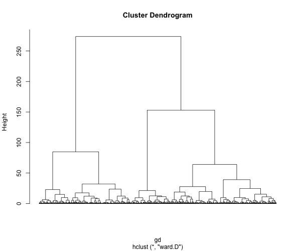

# Informe Tarea 4.2
**Autor**: Samuel Jorquera A.

En esta tarea se identifican similitudes entre grupos de estudio. Consiste en un análisis bifactorial, que contempla 2 tratamientos sobre 2 grupos de estudio, cada uno con 4 réplicas. Así, se tiene un total de 16 muestras.


## Preprocesamiento y normalización

En primer lugar, se normalizan los datos a través del script [normdata](../code/normdata.R). Los reusltados quedan guardados sobre el archivo separado por tabulaciones [normdata.txt](../results/normdata.txt), presente en la carpeta [results](../results).


## Agrupamiento
En el script [Clustering.R](../code/Clustering.R), se encuentra el agrupamiento

### Kmeans
En primer lugar, se utilizó kmeans. La cantidad de grupos fue determinada usando el método del codo (Ver [S1](../results/SSQ_by_K_using_kmeans.png) para sondas y [S2](../results/SSQ2_by_K_using_kmeans.png) para muestras). 



**Figura 1**: Agrupamiento de sondas usando Kmeans


Así como de grupos:



**Figura 2**: Agrupamiento de muestras usando Kmeans.


Así, encontramos que Kmeans agrupo BC y BY.C (grupos control) como grupos, valga la redundancia, propios. Mientras que en los grupos intervenidos BY.I2 y BY.I3 son similares a BY.I y BY.I1, sin embargo, estos últimos se agrupan junto a B.I. Finalmente, dentro de B.I, la muestra B.I2 presenta una alta heterogeneidad respecto al resto de las muestras, de modo que conforma su propio grupo.


### Clustering jerárquico
Se elaboran dendogramas para muestras usando medida euclideana como cálculo de distancia, y para sondas, usando complemento de correlación de pearson. 

Para las muestras, además de usar medida euclideana para separación por disímilitud entre muestras, se generan 5 grupos mediante corte de árboles usando la función ```cutree()``` de R.



**Figura 3**: Dendrograma de muestras. Se agrupan (cajas rojas) según cercanía.


Observamos que, nuevamente, BY.I y BY.I1 son más cercanos a B.I que a los otros grupos BY.I. Sin embargo, en este agrupamiento B.I2, a pesar de ser el más disímil de los BY.I, no aparece como grupo aparte, a diferencia del clustering con Kmeans.


Finalmente, se aplica un agrupamiento jerárquico usando el complemento de correlación de pearson como medida.



**Figura 4**: Dendrograma de genes.

Se aprecian 4 grupos con claras diferencias,


