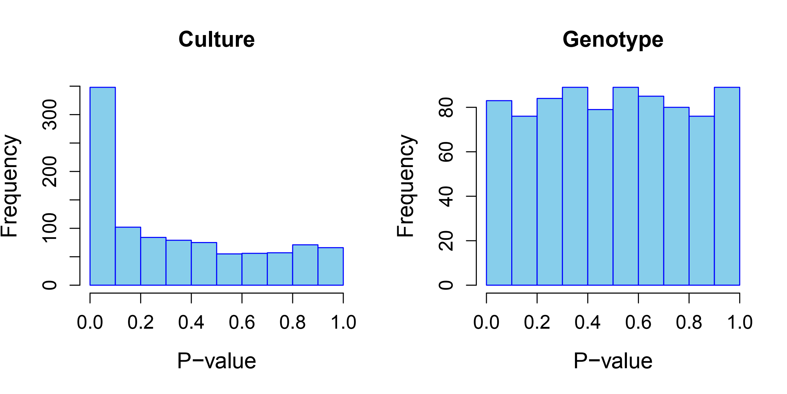
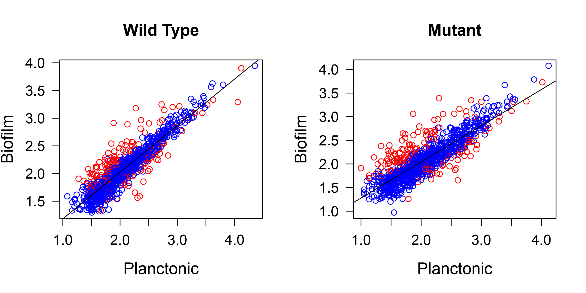
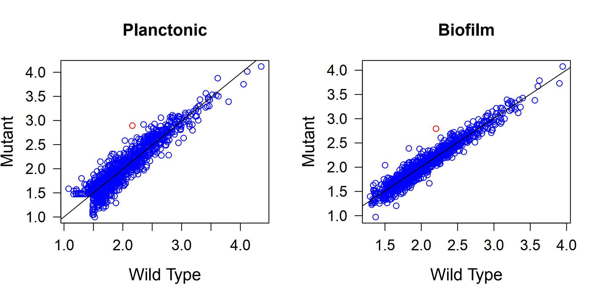

# Informe Tarea 4.3

**Autor**: Samuel Jorquera

## Introducción
En el presente informe se encuentra la resolución de la tarea 4.3, consistente de análisis de expresión diferencial usando datos de RNA seq. En particular, se analizaron 4 grupos según genotipo (WT vs mutado) y medio de cultivo (Plantonico vs Biofilm).

## Metodología

Secuencias fueron filtradas según calidad de lectura, considerando un mínimo de 80% del largo de lectura con una PHRED quality superior a 20.

Luego se alineó con el genoma de referencia *S. acidocaldarius* en su versión *DSM 639*.

Finalmente, las secuencias fueron anotadas para estimar la abundancia de cada gen mapeado usando el programa HTSeq-Count (v0.6.1), determinando así su expresión relativa.

Luego, respecto a la expresión diferencia se determinó usando un test exacto, considerando una distribución binomial negativa, tanto para genotipos como para condición de cultivo.

## Reultados y discusión

En primer lugar, observamos la siguiente distribución de significancia de genes diferencialmente expresados:

**Figura 1**: Histograma de frecuencia de genes según expresión diferencial respecto a medio de cultivo y a genotipo

Se encuentra que, a nivel de medio de cultivo, la mayoría de los genes se encuentran diferencialmente expresados (pvalue < 0.1), mientras que para los diversos genotipos, el nivel de asociación de expresión diferencial es relativamente uniforme. Así, se puede observar que el medio de cultivo es más decisivo respecto al perfil de expresión del organismo, que el propio genotipo.

Luego, podemos observar genes sobre y sub-expresados entre las condiciones para medio de cultivo:

**Figura 2**: Gráfico de dispersión de niveles de expresión de genes para cultivo plantonico (Eje X) y biofilm (Eje y), para especies WT (izquierda) y mutantes (derecha). En rojo se distinguen genes con expresión significativamente diferencial.

Observamos que, aparentemente, tanto para individuos WT como mutantes, hay una distribución similar de DEGs, sugiriendo un efecto uniforme del medio de cultivo independiente del individuo. Sin embargo, se requieren análisis posteriores para concluir respecto de esto.

Así mismo, se puede establecer una figura analóga a la anterior pero para los genotipos:

**Figura 3**: Gráfico de dispersión de niveles de expresión de genes para WT (Eje X) y mutante (Eje y), para cultivo plantónico (izquierda) y biofilm (derecha). En rojo se distinguen genes con expresión significativamente diferencial.

Observamos un único gen con expresión diferencial –particularmente, sobreexpresado en mutantes, tanto en cultivo de biofilm y plantónico. Así, se concluye que, efectivamente, el genotipo no posee un efecto mayor sobre el perfil de expresión diferencial.

Los resultados observados anteriormente concuerdan con lo esperado. El genotipo no debería tener un efecto mayor en la expresión, sobretodo considerando que los organismos poseen mecanismos de compensación ante la alteración de vías metabólicas particulares. Mientras que el medio de cultivo es determinante para el fenotipo. De modo que ante diversos medio, un mismo individuo (isogénico) puede tener un fenotipo totalmente distinto, causado por una expresión diferencial notable.

## Conclusiones.

Se obtienen resultados esperados, donde se observa expresión diferencial causada por el medio de cultivo utilizado, mas no por el genotipo individual.

